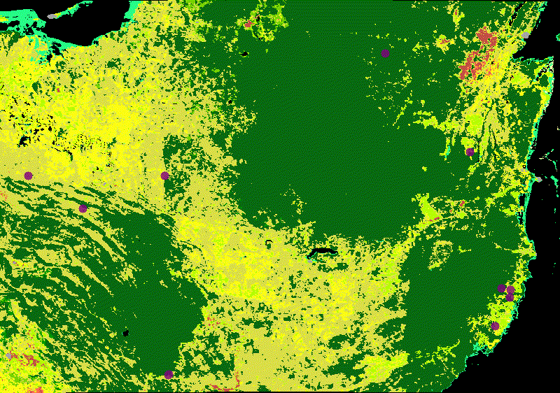

# Mapping Jaguar Presence and Land Cover Change over time around the Mexico-Guatemala-Belize Border

## About
This is part of a remote sensing project for a graduate course using MODIS and GBIF-derived data to visually inspect the distribution of jaguar (Panthera onca) sightings against changes in land use in and around the Mayan Biosphere Reserve from 2008 to 2023.

## Repository Guide

The `data/` folder contains the raw occurrence records (in .txt format) as downloaded from the Global Biodiversity Information Facility (GBIF) as well as the processed records, saved as a CSV file. The data processing was completed using a Python script `clean_gbif_data.py` to filter through occurences, create GeoPandas dataframe and export only relevant rows/columns to import as an _asset_ in __Google Earth Engine__ (GEE). The main file for hangling remote sensing data is `script.js` which needs to run on GEE.

## Results

One of the assets created from this project is a time-series animation where changes in land use (defined by the categories provided by the annual MODIS land use survey) are displayed alongside jaguar sightings for that year. 

